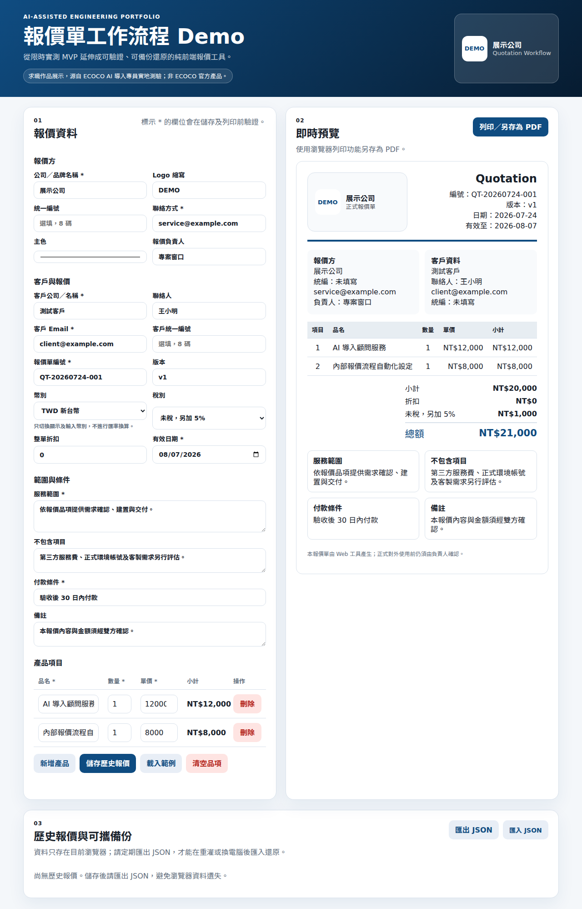

# 報價單工作流程 Demo

這是一個以**限時 MVP → 缺陷重現 → 測試驅動改善**為主軸的 AI 協作工程作品。

原始版本來自 2026-07-02 的 ECOCO AI 導入專員實地測驗：在約 40 分鐘內，把每日人工報價流程做成可公開操作的靜態 Web 工具。2026-07-24 再次審查時，發現負數會污染計算、同日編號重複、瀏覽器資料無法跨機還原等問題，因此以 Playwright 行為測試重現後改善。

> 本 Repo 是求職作品展示，非 ECOCO 官方產品，也不代表 ECOCO 的正式流程、價格、稅務或品牌規範。

## Demo

- 公開網站：<https://pxxd1998.github.io/ecoco-ai-quote-tool-20260702/>
- 原始碼：<https://github.com/pxxD1998/ecoco-ai-quote-tool-20260702>
- AI 協作紀錄：[AI_CODING_LOG.md](./AI_CODING_LOG.md)



> 公開 Demo 以 `main` 分支最近一次成功部署為準。

## 解決的問題

人工建立報價單容易重複輸入、算錯金額，也不易快速預覽。這個工具提供：

- 報價方、客戶、品項、付款條件與服務範圍的單頁輸入。
- 小計、折扣、稅額及總額即時計算。
- 未稅加 5%、未稅加 8% 與免稅／零稅額的明確語意。
- 瀏覽器列印／另存為 PDF。
- 歷史報價儲存、載入、複製及刪除。
- 同日報價單流水號遞增，避免全部固定為 `-001`。
- JSON 匯出／匯入，支援重灌或換電腦後手動還原。
- TWD／USD 顯示切換；**不進行匯率換算**。
- 錯誤摘要及無效欄位標記；無效資料不能儲存或列印。

## 2026-07-24 改善前後

| 面向 | 原始限時 MVP | 作品改善版 |
|---|---|---|
| 負數量／負單價 | 會進入計算 | 標記錯誤，該列不進入金額計算 |
| 負折扣／超額折扣 | 可能提高總額或產生混淆 | 阻止儲存與列印，顯示錯誤原因 |
| 報價編號 | 同日永遠 `-001` | 依歷史資料遞增流水號 |
| 歷史報價 | 最多 8 筆、只能載入 | 最多 100 筆，可載入、複製、刪除 |
| 跨機復原 | 無 | 帶 `schemaVersion` 的 JSON 匯出／匯入 |
| 商務資訊 | 客戶名稱、Email、品項金額 | 增加雙方資料、統編、負責人、範圍、排除項、付款條件、版本及備註 |
| 稅別 | 「免稅／另計」混在一起 | 清楚拆分未稅加計與免稅 |
| PDF 文案 | 宣稱「PDF 下載」 | 誠實標示「列印／另存為 PDF」 |
| 測試 | 無 | Playwright 瀏覽器行為測試 |
| 品牌邊界 | 容易被誤解為官方工具 | 首頁與文件明示求職作品、非官方產品 |

## 資料與隱私邊界

- 不需登入、後端或雲端資料庫。
- 報價資料只寫入目前瀏覽器的 `localStorage`，不會由本工具上傳。
- `localStorage` 不是備份：清除網站資料、換瀏覽器或重灌可能遺失。
- 跨機移動前，必須使用「匯出 JSON」；還原時再用「匯入 JSON」。
- JSON 可能包含自行輸入的客戶資料，使用者應保存於適當的受控位置，不應直接上傳公開 Repo。

## 技術選型

- HTML、CSS、JavaScript
- Playwright Test
- GitHub Pages
- GitHub Actions（候選）

保留純前端架構是有意識的取捨：它可在 Windows 10／11、WSL2 或一般瀏覽器直接執行，也避免為作品 Demo 引入帳號、雲端客戶資料及後端維運風險。

## 本機執行

### Windows PowerShell

```powershell
py -m http.server 4173
```

### WSL2／Ubuntu、Linux 或 macOS

```bash
python3 -m http.server 4173
```

開啟：

```text
http://127.0.0.1:4173/
```

## 測試

第一次安裝：

```bash
npm ci
npx playwright install chromium
```

執行：

```bash
npm test
```

測試涵蓋：

1. 負數量。
2. 負單價與負折扣。
3. 必要欄位、Email 格式與空白單價。
4. 同日流水號。
5. 舊版歷史資料只遷移一次，刪除後不復活。
6. 歷史報價刪除與複製。
7. JSON 匯出／匯入。
8. 商務欄位與誠實文案。
9. 稅別切換。
10. 390px 行動版水平溢出。
11. 不可信匯入內容不執行 HTML／JavaScript。
12. 列印模式只保留正式報價內容。
13. 匯入數字欄位拒絕型別混淆與可執行字串。
14. 畸形品項整批拒絕，不污染 localStorage。
15. 同編號匯入保留既有資料並明確略過。
16. TWD 拒絕無法對帳的小數金額。
17. 流水號超過 999 後持續唯一遞增。

## 專案結構

```text
.
├── index.html
├── style.css
├── script.js
├── tests/quote.spec.js
├── assets/quotation-workflow-demo-20260724.png
├── playwright.config.js
├── package.json
├── AI_CODING_LOG.md
├── SECURITY.md
└── .github/workflows/test.yml
```

## 已知限制

- JSON 備份是手動流程，不是雲端同步。
- 瀏覽器列印結果仍受瀏覽器、紙張及印表機設定影響。
- 幣別切換不做匯率換算。
- 沒有帳號、簽核、寄信、電子簽章或多人協作。
- 稅務、統編及付款條件欄位是 Demo，正式採用前必須由實際企業依會計與法務規則確認。

## AI 協作與人工責任

AI 協助產生程式、拆解測試與整理文件；需求取捨、公開範圍、風險界線及最終驗證仍由人負責。完整證據與 Red→Green 過程見 [AI_CODING_LOG.md](./AI_CODING_LOG.md)。

## 授權狀態

目前 Repo 沒有開源授權檔。依預設著作權規則，這不代表他人可自由重製、修改或散布。若未來要轉成可重用的通用開源工具，應在確認品牌素材與第三方內容後，再明確選擇授權。
